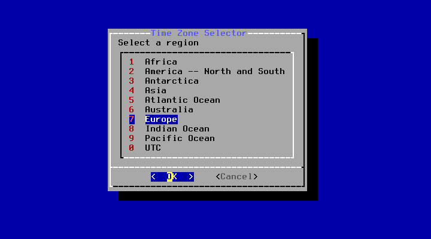
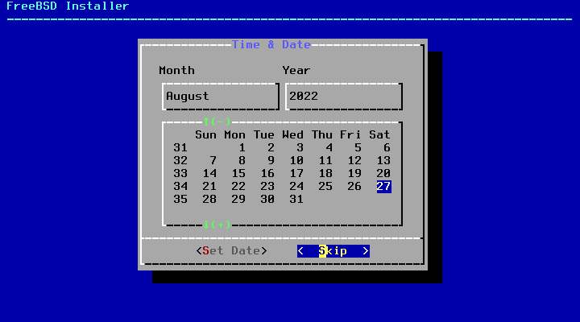
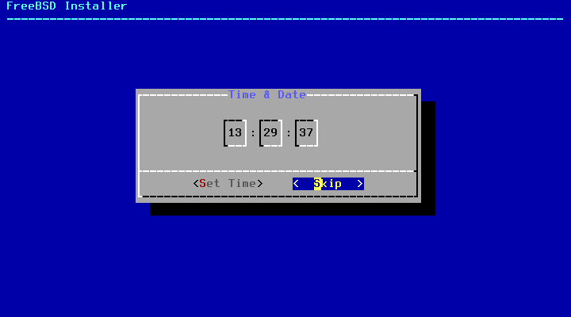
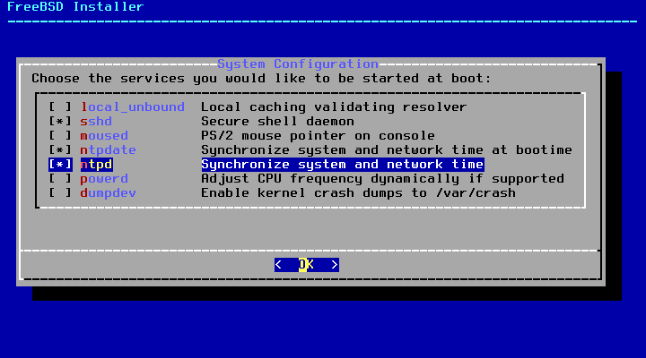
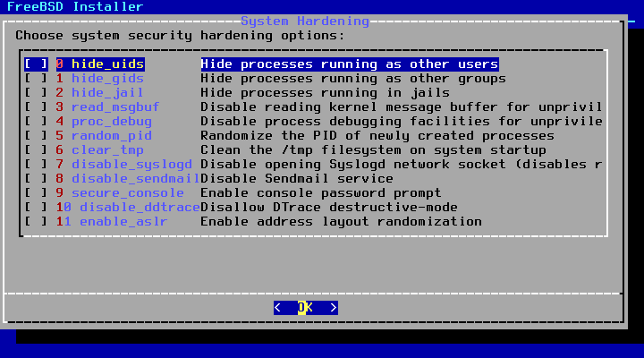
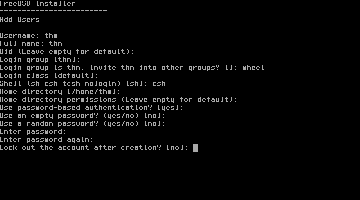
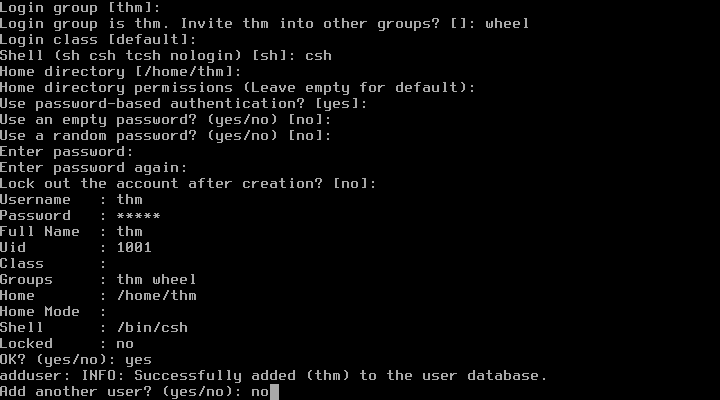
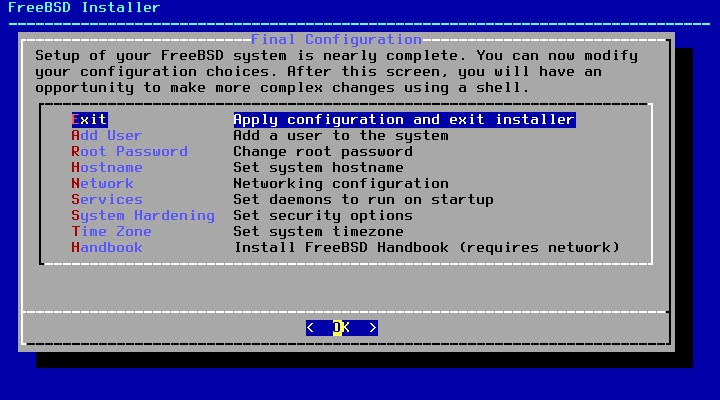
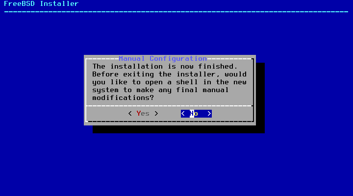
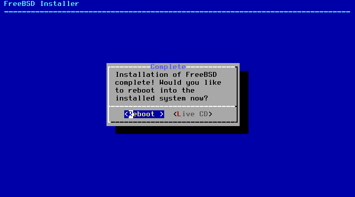

# Файловое хранилище на FreeBSD

## Вступление
Рад привестствовать читателей блога. Наверняка, у каждого есть старые компьютеры на 775. 
Сегодня рассмотрим еще одно из их применений. Файловый сервер будет удобен, если у вас
есть большое количество файлов, которые вы хотели бы где-либо хранить, а места на компьютере 
нет, либо доступ к этим файлам нужен со всех устройств. В этой статье мы рассмотрим установку 
FreeBSD и всех необходимых пакетов (я использую Samba-сервер, Apache, qbittorrent-nox и minidlna)

## Установка FreeBSD
1. <a href="https://freebsd.org/">Скачиваем FreeBSD</a>

2. Загружаемся с образа, нажимаем Enter (или ждем 10 секунд)


3. После загрузки выбираем Install


4. Раскладку оставляем дефолтную


5. Указываем имя хоста. В моем случае, storage.


6. Выбираем нужные компоненты (пробел, чтобы выбрать пункт)
Я выбрал lib32 для 32-битных библиотек и ports для портов


7. Далее, разметка диска. В данном примере будем использовать ZFS. Считается, что ZFS довольна требовательна к ресурсам, однако опыт показал, что 4 ГБ ОЗУ хватает (на сайте FreeBSD сказано, что 1 ГБ - самый минимум)

7.1. Выбираем Auto (ZFS)<br>
<br>

7.2. Переходим в раздел Pool Type/Disks<br>


7.3. Теперь нужно выбрать тип массива дисков.
<ul>
  <li>stripe - простое объединение (также используется для 1 диска)</li>
  <li>mirror - зеркало (если один диск сломается, данные останутся на втором)</li>
  <li>RAID10 - объединение зеркал в один zpool</li>
  <li>RAIDz1 - объединение дисков (1 диск сломается, данные останутся на остальных)</li>
  <li>RAIDz2 - объединение дисков (2 диска сломается, данные останутся на остальных)</li>
  <li>RAIDz3 - объединение дисков (3 диска сломается, данные останутся на остальных)</li>
</ul>
В данном примере буду использовать простой stripe<br>


7.4. Выбираем нужный диск(-и)<br>


7.5. Выбираем пункт Install<br>


7.6. Подтверждаем, что диск выбран правильно<br>


8. Идет процесс распаковки файлов...


9. Устанавливаем пароль пользователя root


10. Настраиваем сеть

10.1. Выбираем сетевой интерфейс<br>


10.2 Соглашаемся на IPv4<br>


10.3 Соглашаемся на DHCP<br>


10.4 Отказываеся от IPv6<br>


10.5 Оставляем дефолтный DNS (Tab, Enter)<br>


11. Выбираем часовой пояс


12. Дата & время (пропускаем)



13. Выбираем службы, которые будут запускаться автоматически (sshd для SSH и ntpd, ntpdate для установки времени по сети)


14. Опции безопасности (оставляем все выключенным)


15. Добавляем своего пользователя (не забываем включить пользователя в группу wheel, чтобы можно было выполнять команды с помощью sudo)




16. Выбираем пункт Exit и перезагружаемся





## Подготовка системы
<ul>
  <li>После загрузки системы заходим под пользователя root.</li>
  <li>Чтобы устанавливать пакеты из репозиториев, нужна утилита pkg. Изначально в системе она не установлена. Пропишите `pkg`, после чего согласитесь на установку pkg.</li>
  <li>Пропишите `pkg update` для обновления репозиториев.</li>
  <li>Установите nano для более удобного редактирования конфигов (<code>pkg install nano</code>)</li>
</ul>


## Установка & конфигурация Samba сервера
1. Пропишите `pkg search samba`, найдите самую последнюю доступную версию Samba (в моем случае, samba413)
2. Установите Samba сервер (`pkg install samba413`)
3. Создаем директорию по пути /storage: `mkdir /storage`
4. Даем всем права на нее: `chmod 777 /storage`
5. Пишем конфиг по пути /usr/local/etc/smb4.conf
```
[global]
  workgroup = WORKGROUP
  server string = Samba Server
  log file = /var/log/samba-log.%m
  max log size = 500
  map to guest = Bad Password
  
[storage]
  path = /storage
  comment = Storage
  writable = yes
  public = yes
  create mask = 0777
  directory mask = 0777
```
4. Редактируем файл /etc/rc.conf: `nano /etc/rc.conf`<br>
Дописать в конец `samba_server_enable="YES"`

5. Создаем пользователя для Samba сервера: `adduser`
6. Задаем пароль, указывая который, будем заходить на сервер: `smbpasswd -a username`, где username - имя только что созданного пользователя


## 
