# Файловое хранилище на FreeBSD

## Вступление
Рад привестствовать читателей блога. Наверняка, у каждого есть старые компьютеры на 775. 
Сегодня рассмотрим еще одно из их применений. Файловый сервер будет удобен, если у вас
есть большое количество файлов, которые вы хотели бы где-либо хранить, а места на компьютере 
нет, либо доступ к этим файлам нужен со всех устройств. В этой статье мы рассмотрим установку 
FreeBSD и всех необходимых пакетов (я использую Samba-сервер, Apache, qbittorrent-nox и minidlna)

## Установка FreeBSD
1. <a href="https://freebsd.org/">Скачиваем FreeBSD</a>

2. Загружаемся с образа, нажимаем Enter (или ждем 10 секунд)
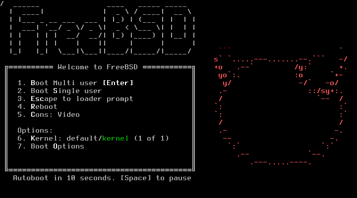

3. После загрузки выбираем Install
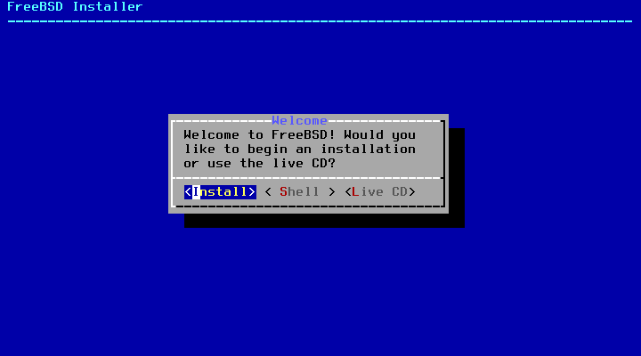

4. Раскладку оставляем дефолтную
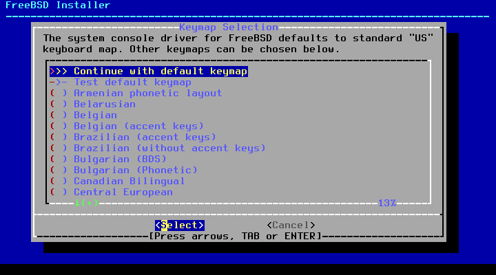

5. Указываем имя хоста. В моем случае, storage.
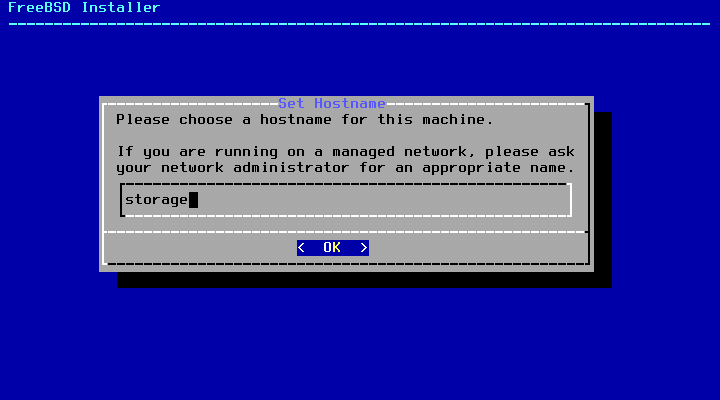

6. Выбираем нужные компоненты (пробел, чтобы выбрать пункт)
Я выбрал lib32 для 32-битных библиотек и ports для портов
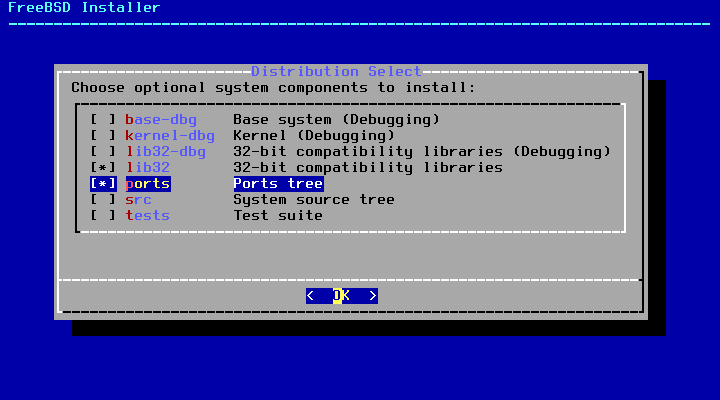

7. Далее, разметка диска. В данном примере будем использовать ZFS. Считается, что ZFS довольна требовательна к ресурсам, однако опыт показал, что 4 ГБ ОЗУ хватает (на сайте FreeBSD сказано, что 1 ГБ - самый минимум)

7.1. Выбираем Auto (ZFS) 
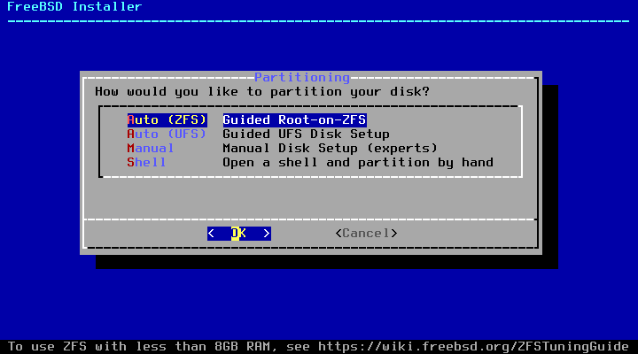 

7.2. Переходим в раздел Pool Type/Disks 
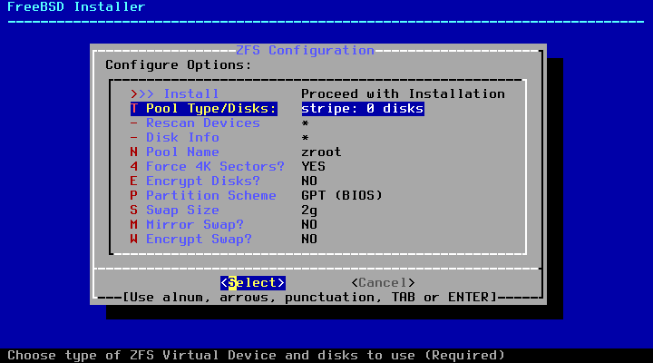

7.3. Теперь нужно выбрать тип массива дисков.
<ul>
  <li>stripe - простое объединение (также используется для 1 диска)</li>
  <li>mirror - зеркало (если один диск сломается, данные останутся на втором)</li>
  <li>RAID10 - объединение зеркал в один zpool</li>
  <li>RAIDz1 - объединение дисков (1 диск сломается, данные останутся на остальных)</li>
  <li>RAIDz2 - объединение дисков (2 диска сломается, данные останутся на остальных)</li>
  <li>RAIDz3 - объединение дисков (3 диска сломается, данные останутся на остальных)</li>
</ul>
В данном примере буду использовать простой stripe 
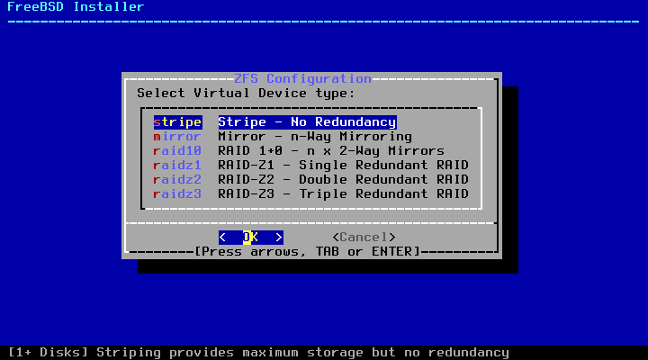

7.4. Выбираем нужный диск(-и) 
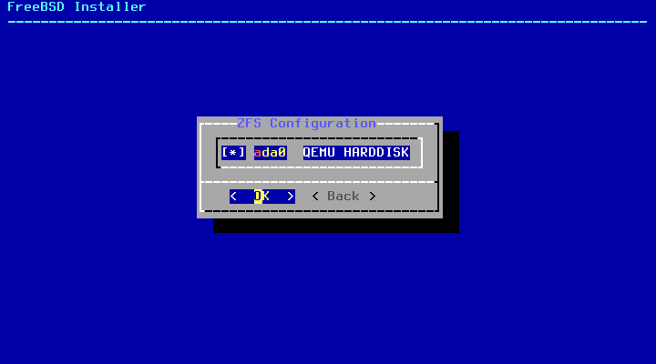

7.5. Выбираем пункт Install 
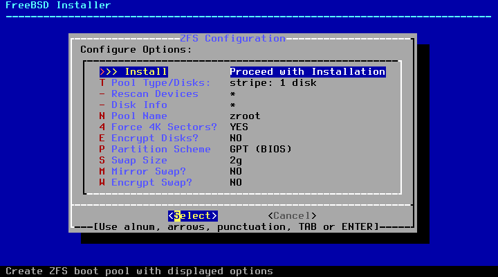

7.6. Подтверждаем, что диск выбран правильно 
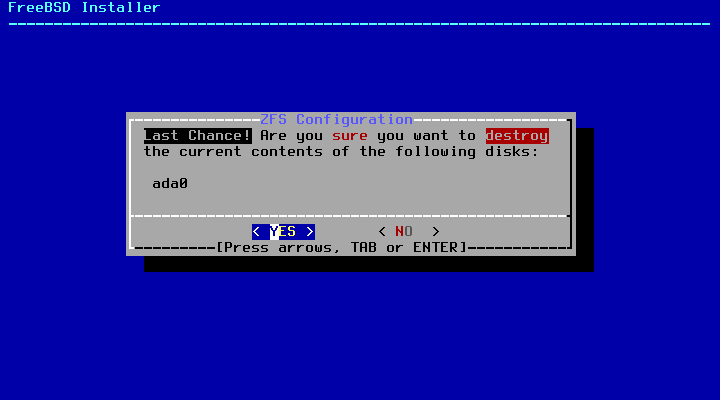

8. Идет процесс распаковки файлов...
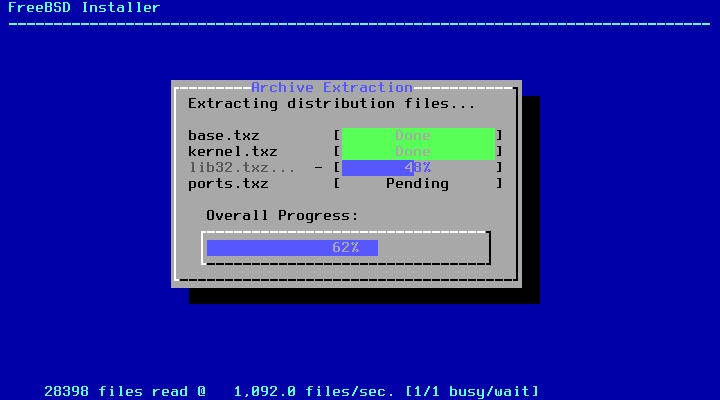

9. Устанавливаем пароль пользователя root
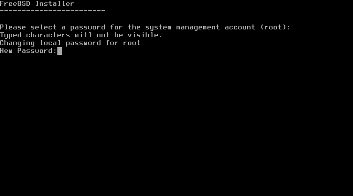

10. Настраиваем сеть

10.1. Выбираем сетевой интерфейс 
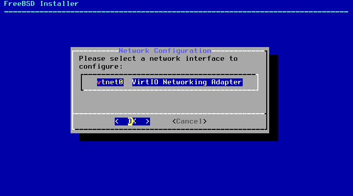

10.2 Соглашаемся на IPv4 
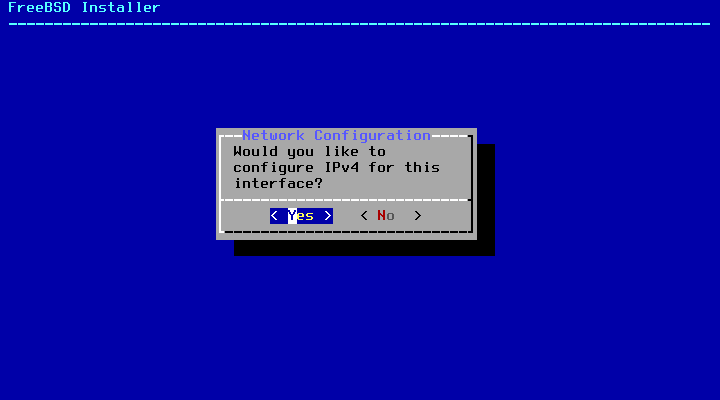

10.3 Соглашаемся на DHCP 
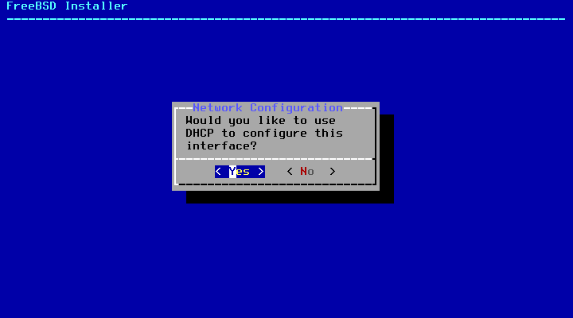

10.4 Отказываеся от IPv6 
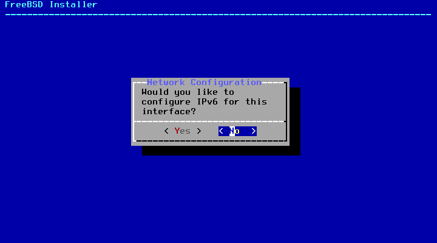

10.5 Оставляем дефолтный DNS (Tab, Enter) 
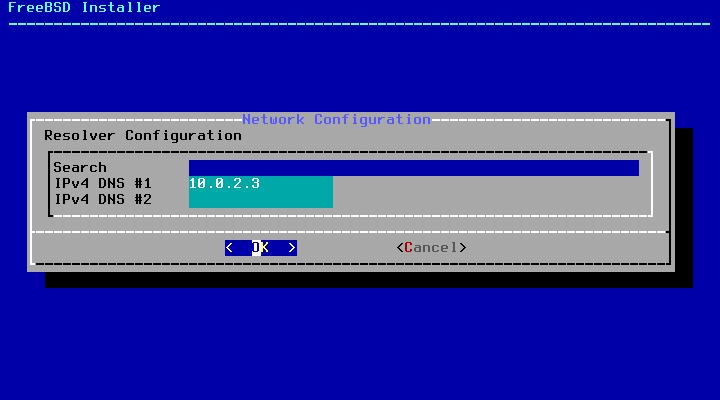
