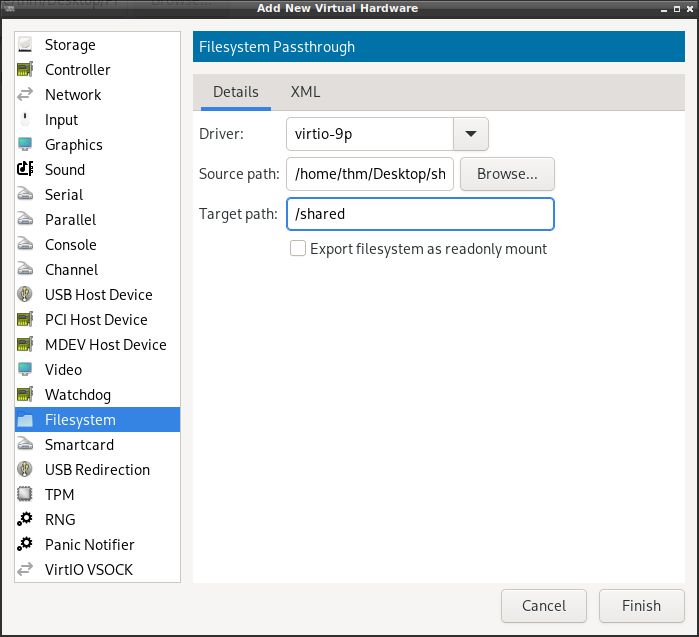

# Общая папка QEMU + virt-manager

## Вступление
Рад приветствовать читателей блога. В этой статье я хочу рассказать о том, как подключить общую папку 
к виртуальной машине QEMU с менеджером виртуальных машин virt-manager.
Если вы ранее использовали VirtualBox, то знаете, что сделать это довольно просто. Давайте разберем
подобную процедуру с QEMU + virt-manager

## Требования
<ul>
  <li>QEMU + virt-manager</li>
  <li>Гостевая ВМ - GNU/Linux</li>
</ul>

## Конфигурация ВМ
1. Откройте вашу ВМ и перейдите на вкладку конфигурации. 
2. Внизу нажиите Add Hardware
3. Слева выберите пункт Filesystem
4. Выберите из выпадающего списка virtio-9p, в Source path выберите папку у себя на хосте, 
а в Target path впишите путь к ней в виртуальной ФС (например, /shared) 
! /shared здесь не значит, что папка будет монтироваться в /shared в ВМ. Это лишь путь
в виртуальной ФС.

## Монтирование общей папки в ВМ
Пропишите в терминале:
`sudo mount -t 9p -o virtio [target] [mount_point]`, где [target] - путь, который вы указали в Target path, [mount_point] - точка монтирования.

В нашем случае:
`sudo mount -t 9p -o virtio /shared /mnt`

Теперь общая папка доступна в указанной точке монтирования.

## Заключение
Мы рассмотрели, как подключить общую папку к GNU/Linux QEMU виртуальной машине. Спасибо за внимание!
