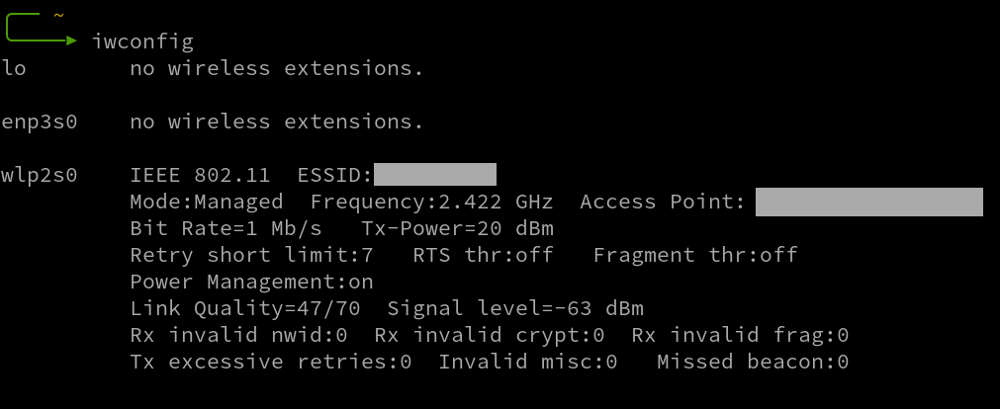
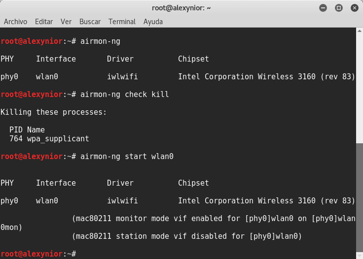

<h1>(Aircrack-ng). Подбор пароля к сети Wi-Fi.</h1>

<b>Материал предоставлен в ознакомительных и образовательных целях.</b> 

<b><i>Содержание</i></b> 
<a href="#introduction">1. Введение. Требования. Суть атаки.</a> 
<a href="#gethandshake">2. Перехват хендшейка.</a> 
<a href="#dictionary">3. Словарь паролей.</a> 
<a href="#getpassword">4. Подбор пароля</a> 
<a href="#end">5. Подведение итогов. Рекомендации по защите.</a> 

<h2>Введение. Требования. Суть атаки.</h2>
Рад приветствовать читателей. В данной статье мы разберем подбор пароля к сети Wi-Fi при
помощи набора утилит aircrack-ng. 
<b>Требования</b>
<ul>
  <li>Wi-Fi адаптер, поддерживающий режим мониторинга</li>
</ul>
Хотелось бы подробнее рассмотреть Wi-Fi адаптер. Любой Wi-Fi адаптер не подойдет. Нужен
тот, который поддерживает режим мониторинга. На текущий момент на рынке не так много
осталось бюджетных таких Wi-Fi адаптеров. <a href="https://hackware.ru/?p=6780&PageSpeed=noscript" target="_blank">Здесь</a> есть список Wi-Fi адаптеров, которые
поддерживают режим мониторинга. При покупке обращайте внимание на ревизию (аппаратную
версию), т.к. большинство Wi-Fi адаптеров новых ревизий имеют совершенно другие чипы,
которые не поддерживают режим мониторинга. 
- 
Суть данной атаки заключается в том, чтобы перехватить хендшейк и расшифровать его.
Хендшейк (с англ. handshake - рукопожатие) - это данные, которыми обменивается точка
доступа (далее - AP) и клиент друг с другом. Этой информации хватает для перебора по
словарю. Перехватывать этот самый хендшейк мы будем путем деаутентификации одного или всех
клиентов от сети. Клиент автоматически попытается снова подключиться к сети. В этот
момент хендшейк и будет перехвачен.

<h2>Перехват хендшейка.</h2>
Для начала нужно перевести ваш Wi-Fi адаптер в режим мониторинга. Для того, чтобы это сделать,
сначала нужно узнать, как называется ваш беспроводной интерфейс в системе. Выполнять команды нужно
от пользователя <b>root</b> (для этого пропишите в терминале <i>sudo su</i>). Пропишите в терминале:
<pre class="hljs" style="display: block; overflow-x: auto; padding: 0.5em; background: rgb(240, 240, 240) none repeat scroll 0% 0%; color: rgb(68, 68, 68);">iwconfig</pre> Результатом этой команды будет список беспроводных интерфейсов. Около проводных интерфейсов будет написано 'No wireless extensions':

Из этой картинки ясно, что в данном случае беспроводным интерфейсом является wlp2s0. В вашем случае скорее всего это будет wlan0 или wlan1.
Следующим шагом нужно убить все процессы, которые будут мешать переводу Wi-Fi адаптера в режим мониторинга:
<pre class="hljs" style="display: block; overflow-x: auto; padding: 0.5em; background: rgb(240, 240, 240) none repeat scroll 0% 0%; color: rgb(68, 68, 68);">airmon-ng check kill</pre> Скорее всего в результате этой команды будут убиты процессы NetworkManager и wpa_supplicant.
Далее переведите Wi-Fi адаптер в режим мониторинга:
<pre class="hljs" style="display: block; overflow-x: auto; padding: 0.5em; background: rgb(240, 240, 240) none repeat scroll 0% 0%; color: rgb(68, 68, 68);">airmon-ng start [wifi]</pre>, где [wifi] - имя беспроводного интерфейса (без скобок). Должно появиться сообщение рода:
 , где должно быть написано о том, что режим мониторинга на интерфейсе N включён. Если появилось сообщение об ошибке, ваш Wi-Fi адаптер не поддерживает режим мониторинга. 
После перевода Wi-Fi адаптера в режим мониторинга, вероятно изменилось имя интерфейса. Проверьте его с помощью iwconfig. Имя могло остаться тем же, либо к прошлому имени могло быть дописано 'mon'.
Далее выведите на экран список доступных сетей Wi-Fi:
<pre class="hljs" style="display: block; overflow-x: auto; padding: 0.5em; background: rgb(240, 240, 240) none repeat scroll 0% 0%; color: rgb(68, 68, 68);">airodump-ng [wifi]</pre>, где [wifi] - новое имя беспроводного интерфейса (без скобок). Результатом будет список Wi-Fi сетей в радиусе действия Wi-Fi адаптера. Перед вами будет таблица, в которой написано: ESSID (имя AP), BSSID (MAC-адрес AP), уровень сигнала, канал. Когда в списке появится нужная вам сеть, остановите процесс (Ctrl + C). Запишите MAC-адрес точки доступа и канал. Эта информация нам далее пригодится.  
Далее измените канал Wi-Fi адаптера на тот, на котором сейчас находится требуемая AP:
<pre class="hljs" style="display: block; overflow-x: auto; padding: 0.5em; background: rgb(240, 240, 240) none repeat scroll 0% 0%; color: rgb(68, 68, 68);">iwconfig [wifi] channel [AP_channel]</pre>, где [wifi] - имя беспроводного интерфейса (без скобок), [AP_channel] - канал нужной AP (без скобок).  
Теперь создайте отдельную директорию для этой сети, перейдите в нее:
<pre class="hljs" style="display: block; overflow-x: auto; padding: 0.5em; background: rgb(240, 240, 240) none repeat scroll 0% 0%; color: rgb(68, 68, 68);">mkdir [dirname] && cd [dirname]</pre>, где [dirname] - имя директории (без скобок).  
И запустите airodump-ng, указав нужную сеть и имя файла, под которым нужно сохранить хендшейк:
<pre class="hljs" style="display: block; overflow-x: auto; padding: 0.5em; background: rgb(240, 240, 240) none repeat scroll 0% 0%; color: rgb(68, 68, 68);">airodump-ng --bssid [MAC] -c [AP_channel] -w handshake [wifi]</pre>, где [MAC] - BSSID требуемой AP (без скобок), [AP_channel] - канал требуемой AP (без скобок), handshake - имя файла, в который будет сохранен хендшейк, [wifi] - имя беспроводного интерфейса (без скобок). 
Теперь откройте новую вкладку терминала, оставив работать airodump-ng в первой. Выполняйте команды от пользователя <b>root</b> (пропишите в терминале <i>sudo su</i>). Нам нужно произвести деаутентификацию клиентов в сети. Для этого, пропишите в терминале:
<pre class="hljs" style="display: block; overflow-x: auto; padding: 0.5em; background: rgb(240, 240, 240) none repeat scroll 0% 0%; color: rgb(68, 68, 68);">aireplay-ng -0 100 -a [MAC] [wifi]</pre>, где 0 - режим работы aireplay-ng, 100 - количество фреймов деаутентификации, которое будет отправлено, [MAC] - BSSID требуемой AP (без скобок), [wifi] - имя беспроводного интерфейса (без скобок). Если после -a [MAC] добавить -c [client_MAC] (где [client_MAC] - MAC-адрес конкретного клиента в сети), то произойдет деаутентификация только этого клиента, а не всех. 
Теперь перейдите на первую вкладку терминала и ждите, пока в правом верхнем углу терминала не появится надпись WPA handshake: [MAC], где [MAC] - BSSID требуемой AP. После этого, можно прерывать и aireplay-ng, и airodump-ng. Все, мы перехватили хендшейк.

<h2>Словарь паролей.</h2>
Теперь осталось только выбрать словарь и подобрать пароль. Существует огромное количество словарей: RockYou, Crackstation и др. В Kali Linux есть стандартные словари, в т.ч. RockYou. Я рекомендую начинать с него, т.к. большинство простых паролей можно найти по нему. Он лежит по пути <i>/usr/share/wordlists/rockyou.txt.gz</i>. Скопируйте архив в текущую директорию и распакуйте его:
<pre class="hljs" style="display: block; overflow-x: auto; padding: 0.5em; background: rgb(240, 240, 240) none repeat scroll 0% 0%; color: rgb(68, 68, 68);">cp /usr/share/wordlists/rockyou.txt.gz ./ && gunzip rockyou.txt.gz</pre>
Если по этому словарю вы ничего не найдете, то у вас есть несколько вариантов: использовать Crackstation (human-only и полный), а также множество других словарей, либо составить свой словарь. Если вы знаете что-либо о владельце сети Wi-Fi, у вас есть его страница в социальной сети, соберите как можно больше информации, и составьте свой словарь.

<h2>Подбор пароля.</h2>
Существует множество утилит для перебора паролей (в т.ч. и Wi-Fi), таких как Hashcat, John the Ripper и пр., которые мы рассмотрим позже, но сейчас мы будем использовать aircrack. Если в текущей директории есть несколько файлов handshake.cap (handshake-01.cap, handshake-02.cap и т.д.), то вероятно вам понадобится самый последний, однако попробуйте все. Запустите перебор пароля:
<pre class="hljs" style="display: block; overflow-x: auto; padding: 0.5em; background: rgb(240, 240, 240) none repeat scroll 0% 0%; color: rgb(68, 68, 68);">aircrack-ng handshake-01.cap -w rockyou.txt</pre>, где handshake-01.cap - имя файла с хендшейком (попробуйте все: -01, -02, ..., если с первым aircrack сообщает, что нет нужных данных), rockyou.txt - имя файла словаря паролей. 
После того, как перебор будет закончен, появится сообщение о том, что либо пароль подобран (KEY FOUND!) и сам пароль, либо что пароль не найден в словаре (KEY NOT FOUND!). 

<h2>Подведение итогов. Рекомендации по защите.</h2>
Для того, чтобы защититься от данной атаки, необходимо установить надежный пароль на вашу AP. Пароль должен содержать:
<ul>
  <li>строчные латинские буквы (a~z)</li>
  <li>прописные латинские буквы (A~Z)</li>
  <li>цифры (0~9)</li>
  <li>специальные значки</li>
</ul>, а также <u><b>НЕ</b></u> содержать имена, даты рождения, города, и любую связанную с вами информацию, даже если ее нельзя найти в интернете.
Также рекомендуется сделать точку доступа скрытой. Тогда это хоть чуть чуть усложнит ее обнаружение.  
Итак, мы рассмотрели подбор пароля к сети Wi-Fi при помощи набора утилит aircrack-ng.  
<a href="../index">Назад к списку статей...</a>
