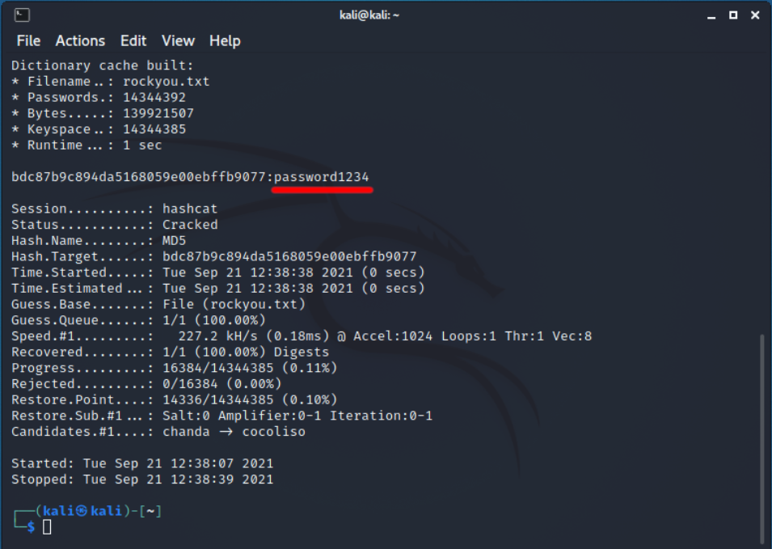
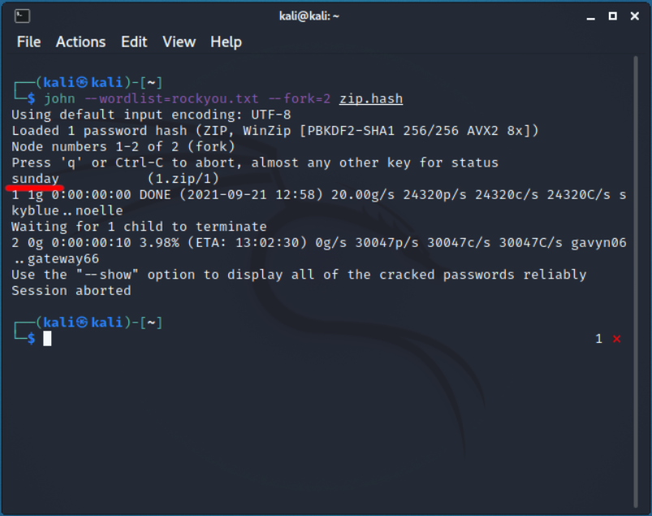

<h1>(John the Ripper, Hydra, Hashcat). Подбор пароля к ZIP/MS Office/SSH/MD5/...</h1>

<b>Материал предоставлен в ознакомительных и образовательных целях.</b> 

<b><i>Содержание</i></b> 
<a href="#introduction">1. Введение. Требования.</a> 
<a href="#ssh">2. Подбор пароля к SSH-серверу.</a> 
<a href="#md5">3. Подбор значения MD5 (без соли).</a> 
<a href="#zip">4. Подбор пароля к *.zip файлу.</a> 
<a href="#msoffice">5. Подбор пароля к файлам MS Office.</a> 
<a href="#unixpasswd">6. Подбор паролей из /etc/shadow.</a> 
<a href="#crackstation">7. Подбор паролей онлайн.</a> 
<a href="#end">8. Подведение итогов. Рекомендации по защите. Полезные ссылки.</a> 

<h2>Введение. Требования.</h2>
Рад приветствовать читателей. В этой статье я хочу разобрать подбор пароля к различным
файлам, серверам и т.д. Мы будем использовать несколько популярных утилит для этих
целей: John the Ripper, Hydra и Hashcat. 
Требования:
<ul>
  <li>Железо, способное нормально перебирать пароли (не используйте для этих целей 
    маломощные процессоры смартфонов/планшетов/..., сэкономите себе нервы)</li>
  <li>Словарь паролей (свой, либо скачанный в интернете)</li>
</ul>

<h2>Подбор пароля к SSH-серверу.</h2>
Для этого мы будем использовать утилиту Hydra. Для данных целей мы будем использовать
тестовый сервер sdf.org. Я создал на нем свою учетную запись, к которой мы и будем
подбирать пароль. Итак, входные данные:
<ul>
  <li>Адрес сервера: tty.sdf.org (205.166.94.9)</li>
  <li>Имя пользователя: thm</li>
  <li>Словарь паролей RockYou</li>
</ul> (не пытайтесь сейчас подобрать пароль, я его уже изменил).
Итак, синтаксис аргументов утилиты Hydra:
<pre class="hljs" style="display: block; overflow-x: auto; padding: 0.5em; background: rgb(240, 240, 240) none repeat scroll 0% 0%; color: rgb(68, 68, 68);">hydra -l [login] -P [/path/to/wordlist] [target]</pre>
(если вы также хотите перебирать логины, то укажите -L вместо -l, а далее путь к файлу с логинами), где [login] - имя пользователя, к которому мы подбираем пароль (без скобок), [/path/to/wordlist] - путь к словарю паролей (без скобок), [target] - адрес сервера (без скобок).
Таким образом, наша команда будет выглядеть так:
<pre class="hljs" style="display: block; overflow-x: auto; padding: 0.5em; background: rgb(240, 240, 240) none repeat scroll 0% 0%; color: rgb(68, 68, 68);">hydra -l thm -P rockyou.txt ssh://205.166.94.9</pre>
Теперь просто ждите, пока будет осуществлен подбор пароля. Если пароль будет успешно подобран, то вы получите сообщение такого рода:

<h2>Подбор значения MD5 (без соли).</h2>
В этой части статьи мы будем подбирать значение к хеш-сумме MD5. В данном примере не будет использоваться <i>соль</i>. 
<b>Соль</b> - некая последовательность символов, которая добавляется к вашему паролю на сайте при регистрации. Таким образом, даже если БД сайта будет украдена, то злоумышленник не сможет подобрать пароль к вашей учетной записи, т.к. к простому паролю добавлена случайная последовательность символов, которой, разумеется, в словаре нет. 
Пример: 
<ul>
  <li>Допустим, есть строка 'password1234'. Применим хеш-функцию MD5 к ней. Результат: <i>bdc87b9c894da5168059e00ebffb9077</i></li>
  <li>Теперь представим, что к этой строке была добавлена последовательность символов: '2#;$72". Получилось: 'password12342#;$72'. Применим MD5 к этой строке.
    Результат: <i>dfc1c9b518499d54f95c607975c3c7e3</i>. Данный хеш подобрать не получится, т.к. в пароле присутствует соль.</li>
</ul>
- 
Вернемся к подбору значения MD5. Для этого мы будем использовать программу Hashcat. Когда вы ее запустите, с ключом -h, то увидите сотни хеш-сумм, с которыми программа умеет работать. В самом начале будет 'md5'. Этот режим имеет код 0. Тогда синтаксис команды будет выглядеть следующим образом:
<pre class="hljs" style="display: block; overflow-x: auto; padding: 0.5em; background: rgb(240, 240, 240) none repeat scroll 0% 0%; color: rgb(68, 68, 68);">hashcat -m 0 -a 0 [md5] [/path/to/wordlist]</pre>, где [md5] - MD5 хеш-сумма (без скобок), [/path/to/wordlist] - путь к словарю паролей (без скобок). После запуска процесса через некоторое время пароль будет успешно подобран:

<h2>Подбор пароля к *.zip файлу.</h2>
В данной части статьи (и последующих) мы будем использовать только John the Ripper. Данная утилита может подбирать значения к практически всем хешам (в т.ч. она может подбирать пароль к хендшейку). Также John the Ripper имеет свой собственный словарь, так что если не указывать путь к словарю, то пароль также может быть подобран. Она имеет возможность поставить перебор на паузу и продолжить его позже. Сейчас же мы будем подбирать пароль к ZIP-файлу. Первым делом преобразуйте архив в хеш:
<pre class="hljs" style="display: block; overflow-x: auto; padding: 0.5em; background: rgb(240, 240, 240) none repeat scroll 0% 0%; color: rgb(68, 68, 68);">zip2john [zip_file] > zip.hash</pre>, где [zip_file] - путь к ZIP-файлу (без скобок). 
После этого запустите перебор:
<pre class="hljs" style="display: block; overflow-x: auto; padding: 0.5em; background: rgb(240, 240, 240) none repeat scroll 0% 0%; color: rgb(68, 68, 68);">john --wordlist=[/path/to/wordlist] --fork=[cores] [/path/to/hash]</pre>, где [/path/to/wordlist] - путь к словарю паролей (без скобок), [cores] - количество ядер процессора, которое вы хотите задействовать (без скобок), [/path/to/hash] - путь к файлу с хешем (без скобок). После подбора вы увидите:

<h2>Подбор пароля к файлам MS Office</h2>
Для начала нужно скачать утилиту office2john:
<pre class="hljs" style="display: block; overflow-x: auto; padding: 0.5em; background: rgb(240, 240, 240) none repeat scroll 0% 0%; color: rgb(68, 68, 68);">wget https://raw.githubusercontent.com/openwall/john/bleeding-jumbo/run/office2john.py</pre>
Далее преобразуйте ваш docx/xlsx/pptx/... файл в хеш:
<pre class="hljs" style="display: block; overflow-x: auto; padding: 0.5em; background: rgb(240, 240, 240) none repeat scroll 0% 0%; color: rgb(68, 68, 68);">python2 office2john.py [office_file] > office.hash</pre>, где [office_file] - путь к файлу MS Office (без скобок). 
И запустите перебор:
<pre class="hljs" style="display: block; overflow-x: auto; padding: 0.5em; background: rgb(240, 240, 240) none repeat scroll 0% 0%; color: rgb(68, 68, 68);">john --wordlist=[/path/to/wordlist] --fork=[cores] [/path/to/hash]</pre>, где [/path/to/wordlist] - путь к словарю паролей (без скобок), [cores] - количество ядер процессора, которое вы хотите задействовать (без скобок), [/path/to/hash] - путь к файлу с хешем (без скобок).

<h2>Подбор пароля из /etc/shadow.</h2>
В UNIX-подобных системах есть файл по пути /etc/shadow. Он содержит зашифрованные пароли пользователей системы. Если вам удалось получить этот файл, то вы можете попробовать перебрать пароли к пользователям из этого файла. John the Ripper также это умеет:
<pre class="hljs" style="display: block; overflow-x: auto; padding: 0.5em; background: rgb(240, 240, 240) none repeat scroll 0% 0%; color: rgb(68, 68, 68);">john --wordlist=[/path/to/wordlist] --fork=[cores] /etc/shadow</pre>, где [/path/to/wordlist] - путь к словарю паролей (без скобок), [cores] - количество ядер процессора, которое вы хотите задействовать (без скобок).

<h2>Подбор паролей онлайн.</h2>
Альтернативным способом подобрать пароль по хешу может быть сайт <a href="https://crackstation.net" target="_blank">crackstation.net</a>. Там же вы можете скачать словарь паролей Crackstation: либо полный (~15 ГБ), либо human-only (~680 МБ).

<h2>Подведение итогов. Рекомендации по защите. Полезные ссылки.</h2>
<h3>Полезные ссылки</h3>
<ul>
  <li><a href="https://hackware.ru/?p=13801&PageSpeed=noscript">Hackware: Полное руководство по John the Ripper. Ч.4: практика и примеры использования John the Ripper</a></li>
  <li><a href="https://crackstation.net/">Crackstation</a></li>
</ul>
<h3>Рекомендации по защите</h3>
Для того, чтобы защититься от данного рода атак, необходимо использовать надежные пароли. Пароль должен содержать:
<ul>
  <li>строчные латинские буквы (a~z)</li>
  <li>прописные латинские буквы (A~Z)</li>
  <li>цифры (0~9)</li>
  <li>специальные значки</li>
</ul>, а также <u><b>НЕ</b></u> содержать имена, даты рождения, города, и любую связанную с вами информацию, даже если ее нельзя найти в интернете. 
Итак, в этой статье мы разобрали перебор паролей различных файлов, серверов и значения MD5.  
<a href="../index">Назад к списку статей...</a>
