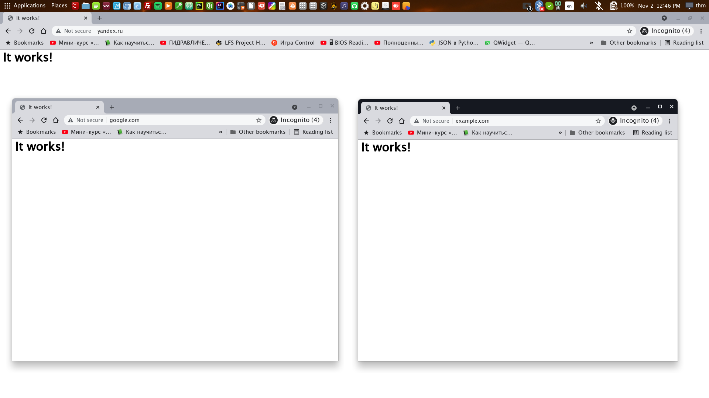

<h1>(Apache, Ettercap). MITM. Часть 4. DNS Spoofing.</h1>

<b>Материал предоставлен в ознакомительных и образовательных целях.</b> 

<b><i>Содержание</i></b> 
<a href="#introduction">1. Введение. Требования.</a> 
<a href="#dns">2. Понятия DNS и DNS Spoofing.</a> 
<a href="#attack">3. Суть атаки.</a> 
<a href="#phishingpage">4. Готовим фишинговую страницу и запускаем Apache.</a> 
<a href="#ettercap">5. Настраиваем и запускаем Ettercap.</a> 
<a href="#result">6. Смотрим на результат</a> 
<a href="#end">7. Подведение итогов. Рекомендации по защите. Полезные ссылки.</a> 

<h2>Введение. Требования.</h2>
Рад приветствовать читателей. В этой статье мы разберем атаку DNS Spoofing  

<i>Если вы не читали предыдущие три статьи по MITM, обязательно прочитайте их перед этой. Там рассмотрены понятие MITM, использование Ettercap, Bettercap, net-creds и Burp Suite</i>

Требования:
<ul>
  <li>Иметь доступ к сети, в которой находится цель</li>
</ul>
<i>Примечание: </i> если у вас уже есть доступ к сети, вам не нужен Wi-Fi адаптер с поддержкой режима 
мониторинга. Главное быть просто подключенным к сети.

<h2>Понятия DNS и DNS Spoofing.</h2>
<b>DNS</b> (Domain Name Server) - компьютерная распределенная система для получения информации о доменах. В большинстве случаев используется для получения IP-адреса по доменному имени.  

<b>DNS Spoofing</b> (a.k.a. DNS Cache Poisoning - отравление кеша DNS) - атака, при которой данные кэша доменных имен изменяются злоумышленником, с целью возврата ложного IP-адреса.

<h2>Суть атаки.</h2>
Т.к. весь трафик пользователя сначала идет через наш компьютер, а затем идет к роутеру (благодаря Ettercap/Bettercap/...), то при помощи плагина в Ettercap под названием dns_spoof можно отравлять кэш DNS-сервера, тем самым перенаправляя пользователя с домена вида www.example.com на произвольный IP адрес.

<h2>Готовим фишинговую страницу и запускаем Apache.</h2>
Первым делом вам нужно написать фишинговую страницу на HTML. Можно использовать HTML/CSS/JavaScript/... Она должна каким-либо образом передавать вам данные, которые ввел атакуемый. Мы же для примера будем использовать страницу It works! 

Положите ее по пути <i>/var/www/html/</i>:
<pre class="hljs" style="display: block; overflow-x: auto; padding: 0.5em; background: rgb(240, 240, 240) none repeat scroll 0% 0%; color: rgb(68, 68, 68);">sudo cp -R mycoolwebsite/* /var/www/html/</pre>, где mycoolwebsite - директория с вашим веб-сайтом.

Затем запустите Apache:
<pre class="hljs" style="display: block; overflow-x: auto; padding: 0.5em; background: rgb(240, 240, 240) none repeat scroll 0% 0%; color: rgb(68, 68, 68);">sudo systemctl start apache2</pre>

<h2>Настраиваем и запускаем Ettercap.</h2>
Заходим под рута:
<pre class="hljs" style="display: block; overflow-x: auto; padding: 0.5em; background: rgb(240, 240, 240) none repeat scroll 0% 0%; color: rgb(68, 68, 68);">sudo su</pre>

В конец файла по пути <i>/etc/ettercap/etter.dns</i> допишите:
<pre class="hljs" style="display: block; overflow-x: auto; padding: 0.5em; background: rgb(240, 240, 240) none repeat scroll 0% 0%; color: rgb(68, 68, 68);">www.example.com A [IP]</pre>, где www.example.com - адрес сайта с www, с которого нужно перенаправлять, [IP] - IP-адрес атакующего в локальной сети, без скобок (ip addr)  

Включите IP Forward:
<pre class="hljs" style="display: block; overflow-x: auto; padding: 0.5em; background: rgb(240, 240, 240) none repeat scroll 0% 0%; color: rgb(68, 68, 68);">echo "1" > /proc/sys/net/ipv4/ip_forward</pre>

Запустите Ettercap:
<pre class="hljs" style="display: block; overflow-x: auto; padding: 0.5em; background: rgb(240, 240, 240) none repeat scroll 0% 0%; color: rgb(68, 68, 68);">ettercap -G</pre>
<ul>
  <li>Выберите интерфейс, нажмите галочку</li>
  <li>Зайдите в главное меню программы (иконка три палки), выберите Plugins, затем Manage plugins</li>
  <li>Дважды нажмите по dns_spoof</li>
  <li>Нажмите на кнопку список хостов (иконка сервера)</li>
  <li>Нажмите на лупу для поиска хостов (если нужного не появилось, попробуйте еще раз)</li>
  <li>Выберите IP адрес роутера как цель 1</li>
  <li>Выберите IP адрес атакуемого как цель 2</li>
  <li>Нажмите на меню MITM</li>
  <li>Выберите ARP Poisoning, убедитесь, что стоит галочка Sniff remote connections и нажмите ОК</li>
</ul>

<h2>Смотрим на результат.</h2>
Атакующий набирает www.yandex.ru, а вместо Яндекса открывается страница It works!, вместо которой вполне могла быть фишинговая страница.
Я также добавил еще пару страниц для того, чтобы показать, что работает это практически везде. Практически, потому что, далеко не у всех сайтов главная страница открывается только по https://. Эти страницы просто напросто не добавлены в тот самый список сайтов, которые открываются только по https:// в браузере. В то же время, например, с Википедией такой трюк не прокатывает и она просто не открывается. Проверить, будет ли работать, можно на сайте HSTS Preload (см. полезные ссылки)

<h2>Подведение итогов. Рекомендации по защите. Полезные ссылки.</h2>
<h3>Полезные ссылки.</h3>
<ul>
  <li><a href="https://ru.wikipedia.org/wiki/DNS" target="_blank">Википедия: DNS</a></li>
  <li><a href="https://ru.wikipedia.org/wiki/DNS-сервер" target="_blank">Википедия: DNS-сервер</a></li>
  <li><a href="https://ru.wikipedia.org/wiki/DNS_spoofing" target="_blank">Википедия: DNS Spoofing</a></li>
  <li><a href="https://losst.ru/ustanovka-ssl-sertifikata-apache-ot-lets-encrypt">Losst: Установка SSL-сертификата на сервер Apache</a></li>
  <li><a href="https://www.youtube.com/watch?v=cHsqZAN0Yr4">YouTube: DNS Spoofing своими руками</a></li>
  <li><a href="https://hstspreload.org" target="_blank">HSTS Preload</a></li>
</ul>

<h3>Рекомендации по защите.</h3>
<ul>
  <li>Не использовать открытые сети Wi-Fi</li>
  <li>Поддерживать безопасность личной сети Wi-Fi, иначе будет равноценна открытой сети</li>
  <li>Использовать расширение HTTPS Everywhere (<a href="https://chrome.google.com/webstore/detail/https-everywhere/gcbommkclmclpchllfjekcdonpmejbdp" target="_blank">Chrome Web Store</a> | <a href="https://addons.mozilla.org/en-US/firefox/addon/https-everywhere" target="_blank">Firefox Browser Add-ons</a>)</li>
</ul>

Итак, мы познакомились с DNS Spoofing.  
<a href="../index">Назад к списку статей...</a>
