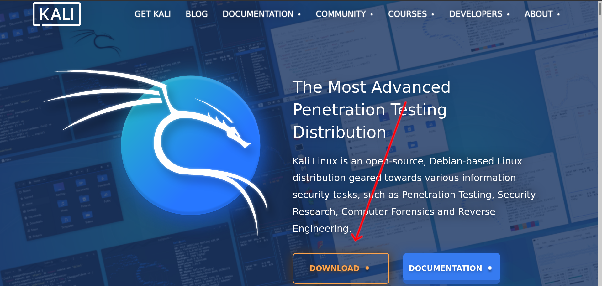
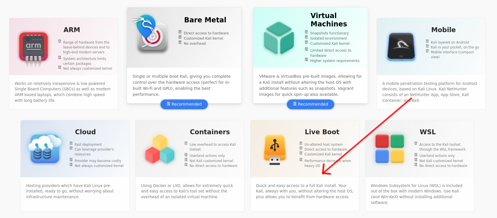
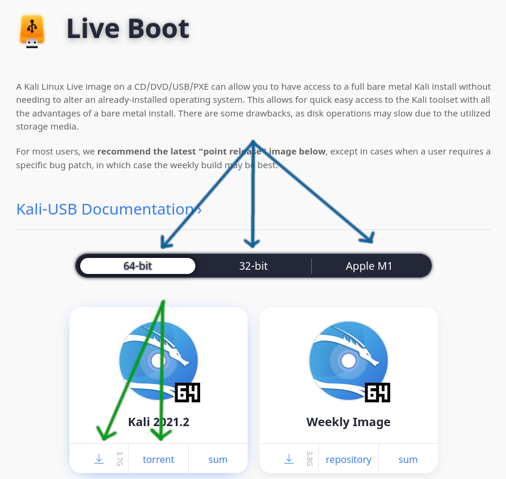

<h1>Введение. Что такое Kali Linux? Подготовка среды.</h1>

<b><i>Содержание</i></b> 
<a href="#introduction">1. Введение. Выбор дистрибутива Linux для пентеста.</a> 
<a href="#usb">2. Понятие Live и Persistence. Запись флешки с Kali Linux.</a> 
3. Первый запуск. 
4. Что сделать после установки? 
5. Подведение итогов. 

<h2>Введение. Выбор дистрибутива Linux для пентеста.</h2>
Рад приветствовать читателей. В этой статье мы разберем подготовку среды для начинающего пентестера. 
Существует множество дистрибутивов для пентеста: Kali Linux, Parrot Security OS, Linux Kodachi и т.д. Мы
будем использовать самый популярный - Kali Linux. Сразу предупреждаю, что Kali Linux лучше не использовать
в качестве повседневной системы. Вряд ли вам будут постоянно нужны все пакеты, установленные в этом
дистрибутиве, а во время обновления системы, скачивание и обновление всех этих пакетов может занять
много времени. 
<b>Требования</b>
<ul>
  <li>Флешка (16 ГБ и больше)</li>
</ul>
Для начала, зайдите на сайт <a href="https://kali.org">kali.org</a> и скачайте последнюю версию дистрибутива.
Нажмите на желтую кнопку Download.

Затем выберите Live Boot

После выберите архитектуру и скачайте файл наиболее удобным способом (через бразуер/через торрент)

<h2>Понятие Live и Persistence. Запись флешки с Kali Linux.</h2>
<b>Live</b> - режим, при котором ОС загружается с флешки, а сделанные изменения в ней не сохраняются. 
<b>Persistence</b> - режим, при котором ОС загружается с флешки, и сделанные изменения сохраняются в раздел, созданный для этих целей. 
Если вы не будете пользоваться режимом Persistence, то запишите скачанный образ на флешку любой доступной для вас утилитой: <a href="https://rufus.ie" target="_blank">Rufus</a>/<a href="https://unetbootin.github.io" target="_blank">UNetbootin</a>/<a href="https://balena.io/etcher" target="_blank">balenaEtcher</a>/dd/... и переходите <a href="#firstrun">к следующему пункту</a>. 
-- 
Если вы хотите сохранять изменения, то следуйте шагам <a href="https://kali.org/prst" target="_blank">в этой статье</a> (Для этого потребуется запустить другой Live, либо установленный дистрибутив GNU/Linux. Используйте для этого виртуальную машину, если не имеете установленного дистрибутива GNU/Linux на хосте). Вкратце, нужно записать флешку с Kali Linux из под другого дистрибутива Linux, затем создать раздел под persistence размером до конца флешки и положить в этот раздел небольшой конфигурационный файл.
