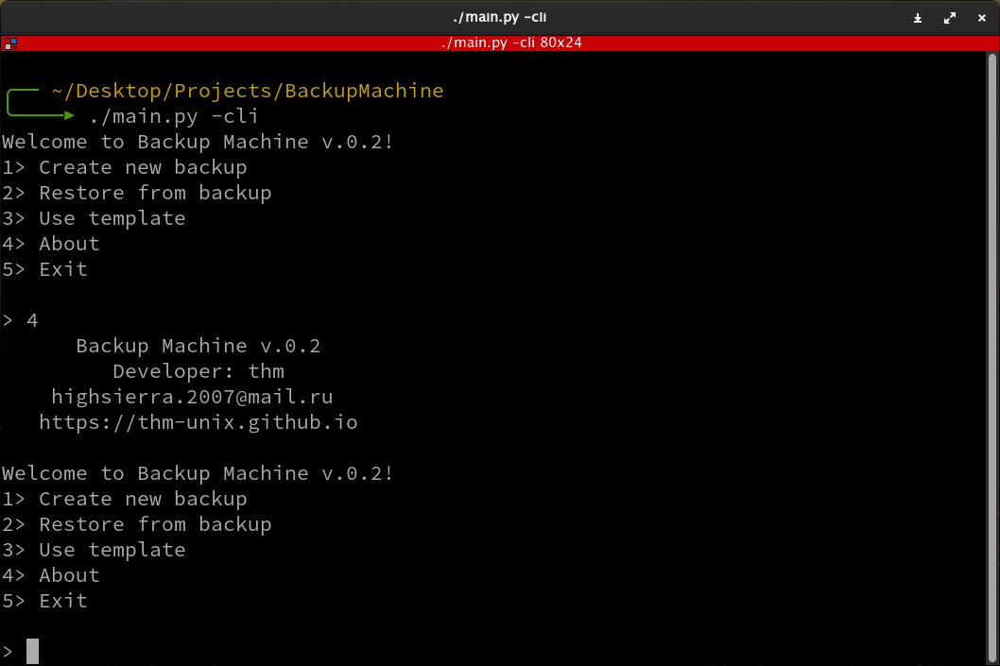
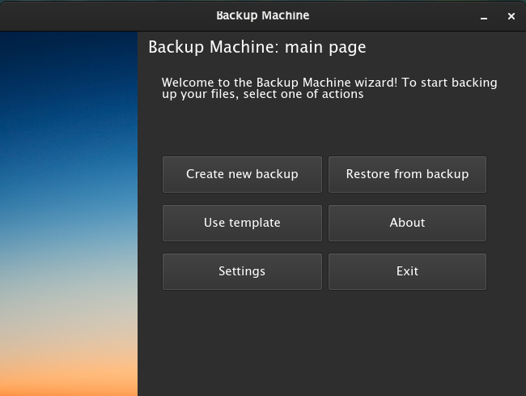

# Backup Machine
Данный проект представляет собой программу, созданную для быстрого создания резервных копий одних и тех же файлов. В этой программе есть возможность создания шаблонов, по которым можно регулярно создавать одни и те же резервные копии. Теперь полнофункциональный CLI! (v.0.2 и выше) 
<a href="https://github.com/thm-unix/BackupMachine" target="_blank">Ссылка на проект на GitHub</a> <b>(см. Installation Guide)</b> 

<a class="github-button" href="https://github.com/thm-unix/BackupMachine/archive/HEAD.zip" data-icon="octicon-download" data-size="large" aria-label="Download thm-unix/BackupMachine on GitHub">Скачать (v.0.2)</a>  
 

