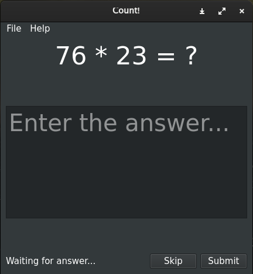

# Count!
Count! - это легковесная программа для тренировки навыков устного счета. Имеет 3 уровня сложности. 
<a href="https://github.com/thm-unix/count" target="_blank">Ссылка на проект на GitHub</a> <b>(см. Installation Guide)</b> 

<a class="github-button" href="https://github.com/thm-unix/count/archive/HEAD.zip" data-icon="octicon-download" aria-label="Download thm-unix/count on GitHub">Скачать (v.0.1.1)</a>

