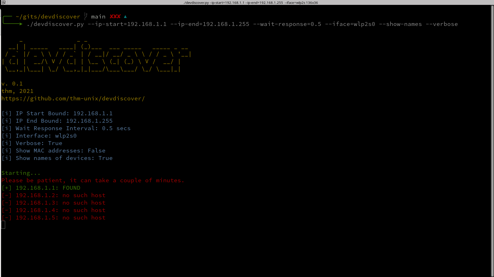

# devdiscover
Утилита для обнаружения устройств в локальной сети в указанном диапазоне IP-адресов.
! Проект является учебным, для реальных задач существует nmap

<a href="https://github.com/thm-unix/devdiscover/" target="_blank">Ссылка на проект GitHub</a> (<b>см. Installation</b>) 
<a class="github-button" href="https://github.com/thm-unix/devdiscover/archive/HEAD.zip" data-icon="octicon-download" aria-label="Download thm-unix/devdiscover on GitHub">Скачать (v.0.1)</a>

