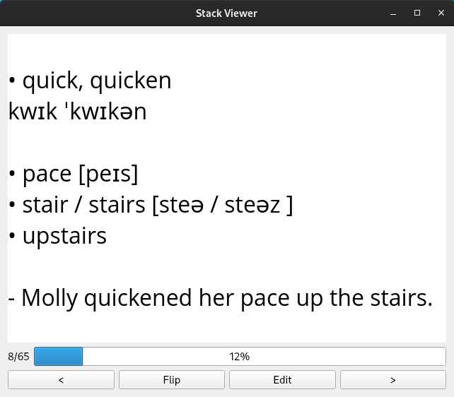

# flashcards
Программа, которая позволяет создавать, учить и экспортировать карточки в PDF. 
<a class="github-button" href="https://github.com/thm-unix/flashcards/archive/HEAD.zip" data-icon="octicon-download" aria-label="Download thm-unix/flashcards on GitHub">Скачать (v.0.1)</a>

