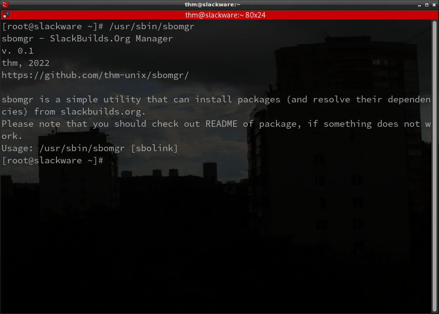

# sbomgr
Небольшая утилита, предназначенная для установки пакетов (и разрешения их зависимостей рекурсивно) из slackbuilds.org

<a href="https://github.com/thm-unix/sbomgr/">Ссылка на проект GitHub</a> (<b>см. Installation</b>) 
<a href="https://github.com/thm-unix/sbomgr/archive/HEAD.zip">Скачать (v.0.1)</a>

