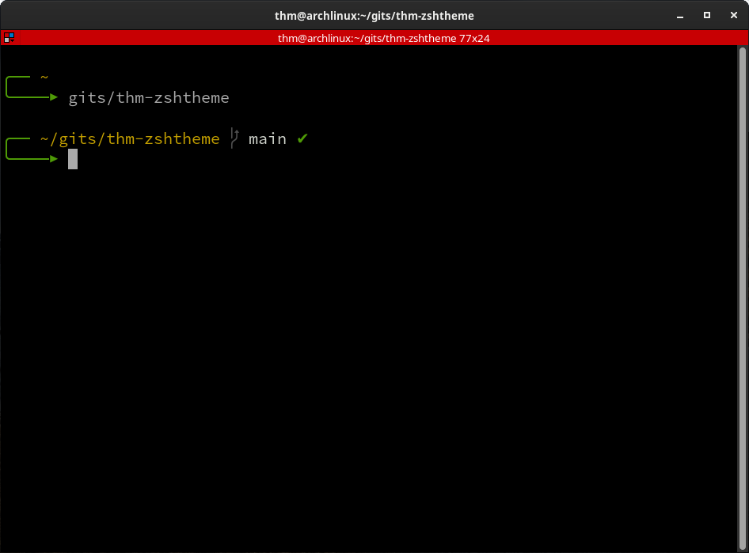

# thm-zshtheme
Еще одна тема для Oh-My-Zsh. 
<a href="https://github.com/thm-unix/thm-zshtheme" target="_blank">Ссылка на проект на GitHub</a> 

<a class="github-button" href="https://github.com/thm-unix/thm-zshtheme/archive/HEAD.zip" data-icon="octicon-download" data-size="large" aria-label="Download thm-unix/thm-zshtheme on GitHub">Скачать</a> 

